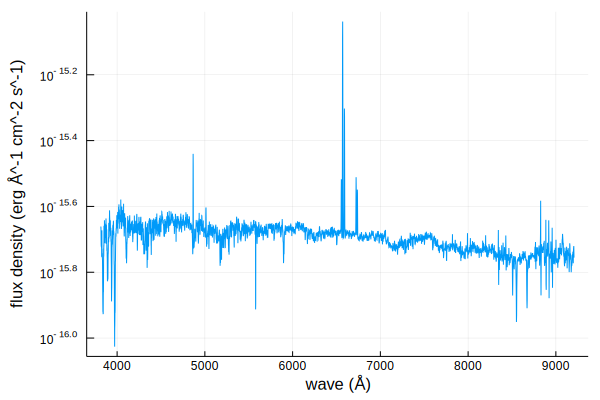

# Spectra.jl

Utilities for interfacing with astronomical spectra and synthetic spectra libraries.

```@contents
Pages = ["index.md", "spectrum.md", "transforms.md"]
```

## Installation

From the REPL, press `]` to enter Pkg mode
```julia
(v 1.2) pkg> add https://github.com/JuliaAstro/Spectra.jl

julia> using Spectra
```

## Quick Start

Here is a quick demo of some of our features

```jldoctest guide
julia> using Spectra, FITSIO, Unitful, UnitfulAstro, Plots

julia> download("https://dr14.sdss.org/optical/spectrum/view/data/format=fits/spec=lite?plateid=1323&mjd=52797&fiberid=12", "sdss.fits");

julia> f = FITS("sdss.fits")
File: sdss.fits
Mode: "r" (read-only)
HDUs: Num  Name     Type   
      1             Image  
      2    COADD    Table  
      3    SPECOBJ  Table  
      4    SPZLINE  Table  

julia> wave = 10 .^ read(f[2], "loglam") * u"angstrom";

julia> flux = read(f[2], "flux") .* 1e-18 * u"erg/s/cm^2/angstrom";

julia> spec = spectrum(wave, flux)
UnitfulSpectrum (3827,)
  λ (Å) f (erg Å^-1 cm^-2 s^-1)

julia> plot(spec);

```



```jldoctest guide
```

## Citation

If you found this software or any derivative work useful in your academic work, I ask that you please cite the code.

```
TODO
```

## Contributing

Please see [Contributing](@ref contrib) for information on contributing and extending Spectra.jl.
