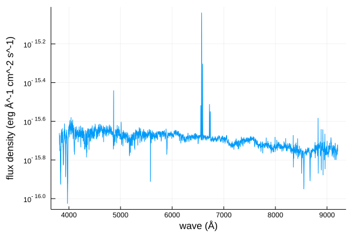

# SpectrumBase.jl

Utilities for interfacing with astronomical spectra and synthetic spectra libraries.

```@contents
Pages = ["index.md", "spectrum.md", "transforms.md"]
```

## Installation

From the REPL, press `]` to enter Pkg mode

```julia-repl
pkg> add https://github.com/JuliaAstro/SpectrumBase.jl

julia> using SpectrumBase
```

## Quick Start

Here is a quick demo of some of our features.

### Spectrum construction

```@meta
# The doctest below reads `sdss.fits` via a relative path. When doctests are run
# from the test suite (rather than the doc build) the working directory is a
# temporary build root, so move into `docs/` where the data file lives. This is a
# no-op during the regular doc build.
DocTestSetup = quote
    using SpectrumBase
    cd(joinpath(pkgdir(SpectrumBase), "docs"))
end
```

```@repl
using SpectrumBase, FITSIO, Unitful, UnitfulAstro, Plots
# fitsurl = "https://dr14.sdss.org/optical/spectrum/view/data/format=fits/spec=lite?plateid=1323&mjd=52797&fiberid=12";
# f = FITS(HTTP.get(fitsurl).body)
f = FITS("sdss.fits")
wave = (10 .^ read(f[2], "loglam"))u"angstrom";
flux = (read(f[2], "flux") .* 1e-17)u"erg/s/cm^2/angstrom";
spec = spectrum(wave, flux)
plot(spec);
```



For constructing higher dimensional spectra, e.g., for echelle or IFU spectra, see the docstrings for [EchelleSpectrum](@ref) and [IFUSpectrum](@ref), respectively.

## Citation

If you found this software or any derivative work useful in your academic work, I ask that you please cite the code.

```
@misc{SpectrumBase.jl,
  author = {Miles Lucas and contributors},
  title  = {SpectrumBase.jl: Utilities for interfacing with astronomical spectra},
  url    = {https://github.com/JuliaAstro/SpectrumBase.jl},
  year   = {2024}
}
```

## Contributing

Please see [Contributing](@ref contrib) for information on contributing and extending SpectrumBase.jl.
