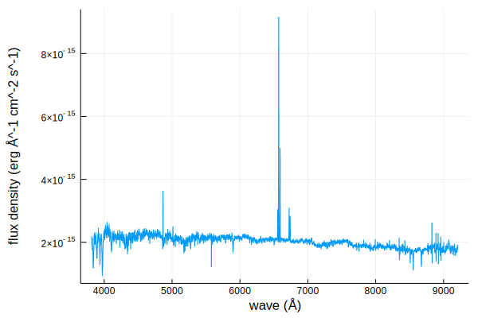
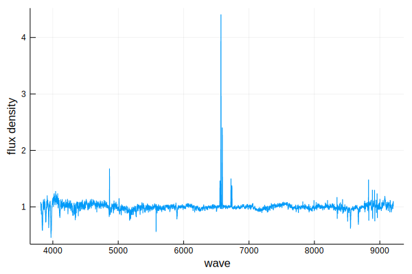

# Spectra.jl

Utilities for interfacing with astronomical spectra and synthetic spectra libraries.

```@contents
Pages = ["index.md", "spectrum.md", "transforms.md"]
```

## Installation

From the REPL, press `]` to enter Pkg mode

```julia-repl
pkg> add https://github.com/JuliaAstro/Spectra.jl

julia> using Spectra
```

## Quick Start

Here is a quick demo of some of our features

```jldoctest guide
julia> using Spectra, FITSIO, Unitful, UnitfulAstro, Plots

julia> fitsurl = "https://dr14.sdss.org/optical/spectrum/view/data/format=fits/spec=lite?plateid=1323&mjd=52797&fiberid=12";

julia> # download(fitsurl, "sdss.fits");

julia> f = FITS("sdss.fits")
File: sdss.fits
Mode: "r" (read-only)
HDUs: Num  Name     Type
      1             Image
      2    COADD    Table
      3    SPECOBJ  Table
      4    SPZLINE  Table

julia> wave = (10 .^ read(f[2], "loglam"))u"angstrom";

julia> flux = (read(f[2], "flux") .* 1e-17)u"erg/s/cm^2/angstrom";

julia> spec = spectrum(wave, flux)
Spectrum(Quantity{Float32, 𝐋, Unitful.FreeUnits{(Å,), 𝐋, nothing}}, Quantity{Float64, 𝐌 𝐋^-1 𝐓^-3, Unitful.FreeUnits{(Å^-1, erg, cm^-2, s^-1), 𝐌 𝐋^-1 𝐓^-3, nothing}})

julia> plot(spec);
```



```jldoctest guide
julia> cont_fit = continuum(spec)
Spectrum(Quantity{Float32, 𝐋, Unitful.FreeUnits{(Å,), 𝐋, nothing}}, Quantity{Float64, 𝐌 𝐋^-1 𝐓^-3, Unitful.FreeUnits{(Å^-1, erg, cm^-2, s^-1), 𝐌 𝐋^-1 𝐓^-3, nothing}})
  coeffs: Quantity{Float64, 𝐌 𝐋^-1 𝐓^-3, Unitful.FreeUnits{(Å^-1, erg, cm^-2, s^-1), 𝐌 𝐋^-1 𝐓^-3, nothing}}[1.983151896157275e-15 erg Å^-1 cm^-2 s^-1, -1.8822235406858172e-16 erg Å^-1 cm^-2 s^-1, -1.0422747454613038e-16 erg Å^-1 cm^-2 s^-1, 4.811210106139895e-17 erg Å^-1 cm^-2 s^-1]
  normalized: true

julia> plot(cont_fit, xlims=(6545, 6600));
```



## Citation

If you found this software or any derivative work useful in your academic work, I ask that you please cite the code.

```
TODO
```

## Contributing

Please see [Contributing](@ref contrib) for information on contributing and extending Spectra.jl.
